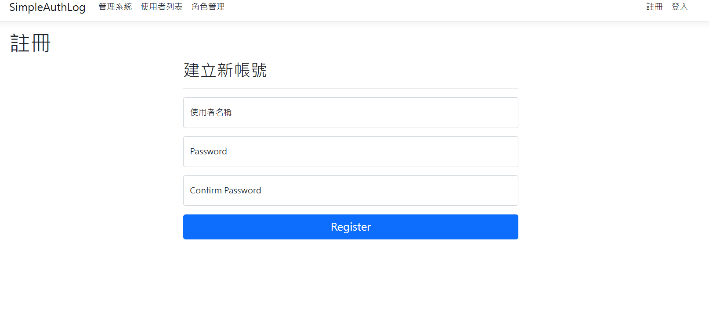
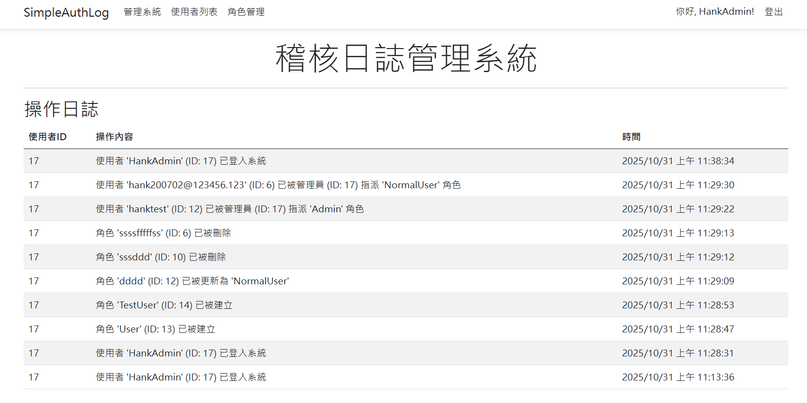

# 簡易權限與操作日誌管理系統 (Simple RBAC & Audit Log System)

## 專案目的

這是一個為了應徵 **中菲「智能資安軟體事業部」** 職缺而準備的後端專案原型。

專案旨在模擬其核心產品「電腦特權帳號管理系統」中的關鍵功能。與初期原型不同，此版本已**全面導入 ASP.NET Core Identity 框架**，從一個簡單的 CRUD 展示，升級為一個**具備完整「身份驗證 (AuthN)」與「角色型存取控制 (AuthZ)」** 功能的安全系統。

此專案的目的是展現本人對資安系統核心的理解、專業的架構重構能力，以及建構一個安全、穩健、功能閉環的後端服務的實作能力。

## 技術棧 (Tech Stack)

* **後端語言:** C#
* **框架:** .NET 8 (專案已從 .NET 9 遷移至 .NET 8 LTS 版本以確保穩定性)
* **核心安全框架:** **ASP.NET Core Identity** (用於身份驗證與授權)
* **架構:**
    * **前端 (Admin Portal):** Server-Side Razor Pages
    * **後端 (API):** ASP.NET Core Web API
    * **服務層:** 使用 `IAuditService` 實作服務導向架構 (SOA)
* **資料庫:** MS SQL Server (本地 LocalDB / Azure SQL)
* **ORM:** Entity Framework Core 8 (Code-First 模式)
* **API 文件:** Swashbuckle / Swagger
* **開發工具:** Visual Studio 2022, SSMS, Git

## 核心功能

專案已從原型重構為一個功能完整的安全系統，包含以下三大核心模組：

### 1. 身份驗證與授權 (AuthN & AuthZ) - 系統安全基石

* **完整 Identity 框架：** 拋棄了自建的 `User` / `Role` Model，**全面遷移**至 `IdentityDbContext`、`IdentityUser<int>` 和 `IdentityRole<int>`，採用業界標準的安全實踐。
* **安全密碼儲存：** 利用 Identity 框架，所有使用者密碼均採用**加鹽雜湊 (Salted Hashing - BCrypt)** 進行儲存，不再使用舊的 SHA256。
* **客製化登入/註冊：**
    * **移除 Email：** 移除了 Identity 預設的 Email 欄位，實作「**純使用者名稱 (Username-only)**」的註冊與登入流程。
    * **介面中文化：** 將登入/註冊頁面完全中文化，並移除多餘的「第三方登入」區塊，提升使用者體驗。
* **角色型存取控制 (RBAC)：**
    * **頁面鎖定：** 使用 `[Authorize(Roles = "Admin")]` 屬性，確保「使用者管理」和「角色管理」頁面**只有 Admin 才能存取**。
    * **API 鎖定：** `PUT`, `DELETE` 等高風險 API 同樣受到 `[Authorize(Roles = "Admin")]` 保護。
* **API 錯誤處理：** 客製化 Identity 的 Cookie 行為，當 API 請求權限不足時，會正確回傳 `401 / 403` 錯誤碼，而不是重新導向到登入頁面。

### 2. 稽核日誌 (Audit Log) - 完整的「工作單元」

* **服務化 (IAuditService)：** 將日誌記錄邏輯從 Controller 中抽離，重構成可注入的 `IAuditService`。
* **資料庫交易 (Unit of Work)：** 系統中所有關鍵操作（建立使用者、指派角色、刪除角色...）**全部**被包裹在 `Database.BeginTransactionAsync()` 交易中。
* **保證資料一致性：** `IAuditService` 只將日誌寫入記憶體，**主程式**必須呼叫 `_context.SaveChangesAsync()` 並 `transaction.CommitAsync()`，這確保了「**操作**」和「**日誌**」**必須同時成功或同時失敗**，杜絕了資料不一致的風險。
* **精確記錄「操作者」：** 日誌中的 `UserId` 已修正為**操作者 (Admin) 的 ID** (`User.FindFirstValue(ClaimTypes.NameIdentifier)`)，不再是 `0` 或被操作者的 ID。
* **完整記錄：** 現在可記錄**登入**、**註冊**、**角色指派**、**角色移除**等所有關鍵安全事件。

### 3. 管理介面 (Admin Dashboard) - Server-Side 實踐

* **架構重構：** 拋棄了舊的「Razor Page 呼叫 HttpClient」的模式，改為更高效、更安全的**「Razor Page (PageModel) 直接呼叫 `UserManager` 和 `RoleManager`」**的伺服器端架構。
* **使用者管理 (User Management)：**
    * `[Read]` 查詢：在列表中可**即時顯示**每位使用者擁有的**所有角色** (`UserWithRolesViewModel`)。
    * `[Assign]` 指派：提供**彈出式視窗 (Modal)**，可從下拉選單中為使用者指派新角色。
    * `[Revoke]` 撤銷：可在角色標籤上點擊 **"X"** 按鈕，即時**移除**使用者的特定角色。
    * `[Update]` 更新：可編輯使用者名稱或重設密碼。
    * `[Delete]` 刪除：可刪除使用者。
* **角色管理 (Role Management)：**
    * `[Create]` 新增：可建立新角色，並具備「**角色名稱不得為空**」和「**角色已存在**」的後端防呆驗證。
    * `[Update] / [Delete]`：可更新或刪除現有角色。
* **UI/UX:** 所有操作均有 `TempData` 提供的「成功」或「失敗」提示訊息。

## 功能截圖 (已更新)







## 如何在本機運行

1.  **前置需求:**
    * Visual Studio 2022 (需安裝 "ASP.NET and web development" 工作負載)
    * **.NET 8 SDK** (專案已遷移至 v8)
    * MS SQL Server (Express, Developer, 或 LocalDB 皆可)

2.  **Clone 儲存庫:**
    ```bash
    git clone https://github.com/hankbean/SimpleAuthLogSystem.git
    ```

3.  **開啟專案:**
    * 使用 Visual Studio 2022 開啟 `SimpleAuthLog.sln` 檔案，等待 NuGet 套件自動還原。

4.  **設定資料庫連線:**
    * 打開 `appsettings.Development.json` 檔案。
    * 確認 `ConnectionStrings` 中的 `DefaultConnection` 指向你的本地 SQL Server 實例 (預設使用 LocalDB)。

5.  **建立資料庫 (遷移):**
    * 在 Visual Studio 中，選擇「工具」 > 「NuGet 套件管理員」 > 「套件管理器主控台」。
    * 執行指令，EF Core 將會自動建立所有 `Identity` 和 `AuditLog` 表格：
    ```powershell
    Update-Database
    ```

6.  **啟動專案:**
    * 按下 `F5` 啟動專案。

## (重要！) 如何建立你的第一個 Admin 帳號

本專案已受 `[Authorize(Roles = "Admin")]` 保護，你必須手動建立第一個 Admin 才能使用管理功能。

1.  **(本地) 暫時解除鎖定：**
    * 打開 `Pages/Users.cshtml.cs` 和 `Pages/Roles.cshtml.cs`。
    * **暫時註解掉 (`//`)** 檔案最上方的 `[Authorize(Roles = "Admin")]` 屬性。
2.  **啟動專案 (F5)。**
3.  **建立 Admin 角色：**
    * 瀏覽至 `/Roles` 頁面。
    * 建立一個新角色，名稱**必須**為 `Admin`。
4.  **建立 Admin 帳號：**
    * 點擊右上角的「註冊」。
    * 註冊你的第一個管理員帳號 (例如 `AdminHank`)。
5.  **指派角色：**
    * 瀏覽至 `/Users` 頁面。
    * 找到你剛建立的 `AdminHank` 帳號，點擊「指派角色」。
    * 從下拉選單中選擇 "Admin" 並確認指派。
6.  **(本地) 恢復鎖定：**
    * **登出**網站。
    * 停止專案。
    * 回到 Visual Studio，**取消註解** `Pages/Users.cshtml.cs` 和 `Pages/Roles.cshtml.cs` 檔案的 `[Authorize(Roles = "Admin")]` 屬性。
7.  **完成！**
    * 重新啟動專案 (F5)，你現在可以用 `AdminHank` 帳號登入，並存取所有受保護的管理頁面。

## 未來可擴充方向

* **JWT 驗證：** 目前 `[Authorize]` 依賴的是 Cookie。下一步是為 `/api` 端點導入 **JWT Bearer Token** 驗證，使其成為可供第三方（例如手機 App）呼叫的「無狀態 (Stateless)」API。
* **資料庫種子 (Seeding)：** 將「建立第一個 Admin」的流程自動化，改用 `DbSeeder` 在 `Program.cs` 啟動時自動初始化 `Admin` 角色和預設 Admin 帳號。
* **Email 服務：** 重新整合 `IEmailSender`，實作「忘記密碼」和「Email 驗證」功能。