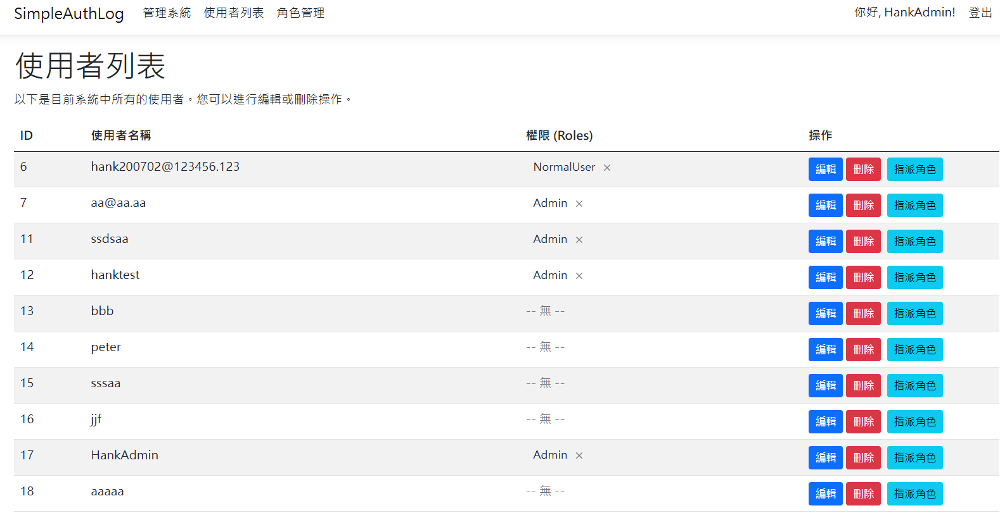
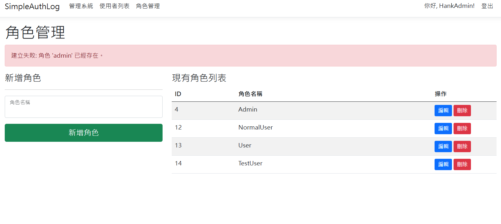

# 簡易權限與操作日誌管理系統 (Simple RBAC & Audit Log System)

## 專案目的

這是一個為了應徵 **中菲「智能資安軟體事業部」** 職缺而特別準備的後端專案原型 (Prototype)。

專案旨在模擬其核心產品「電腦特權帳號管理系統」中的關鍵功能，特別是**使用者/角色的 CRUD 管理**與**詳盡的稽核日誌 (Audit Log)**。

此專案的目的是展現本人對貴部門業務領域的理解、快速學習新技術棧 (.NET) 的能力，以及建構一個功能完整、架構清晰的後端服務的實作能力。

## 技術棧 (Tech Stack)

* **後端語言:** C#
* **框架:** .NET 9 / ASP.NET Core
* **架構:** 同時包含 Web API (後端) 與 Razor Pages (前端) 的混合式架構
* **資料庫:** MS SQL Server
* **ORM:** Entity Framework Core 9 (Code-First 模式)
* **API 文件:** Swashbuckle / Swagger
* **開發工具:** Visual Studio 2022, SSMS, Git

## 核心功能

本專案已完成一個最小可行性產品 (MVP)，包含以下三大核心模組：

### 1. 稽核日誌 (Audit Log) - 系統的靈魂

* **即時監控:** 在首頁即時顯示系統中發生的所有關鍵操作。
* **記錄「誰、何時、做了什麼」:** 完整記錄了使用者的**新增**、**更新**、**刪除**，以及角色的**新增**、**更新**、**刪除**等行為，符合資安稽核的基本要求。
* **後端觸發:** 日誌記錄的邏輯被封裝在後端 API 中，確保任何透過 API 的操作都會被忠實記錄，前端無法繞過。

### 2. 使用者管理 (User Management) - 完整的 CRUD

* **[Read] 查詢:** 在「使用者管理」頁面，以表格形式呈現所有系統使用者。
* **[Create] 新增:** 在首頁可新增使用者，後端 API 會自動對密碼進行**雜湊 (Hashing)** 處理後才存入資料庫，確保密碼不以明文儲存。
* **[Update] 更新:** 在使用者列表中，可點擊「編輯」按鈕，透過彈出式視窗 (Modal) 更新使用者名稱或重設密碼。
* **[Delete] 刪除:** 可刪除指定使用者，並有 JavaScript `confirm` 彈窗防止誤觸。

### 3. 角色管理 (Role Management) - 完整的 CRUD

* **[Read] 查詢:** 在「角色管理」頁面，以表格形式呈現所有系統角色 (如 Admin, User)。
* **[Create] 新增:** 可在頁面左側表單中快速建立新角色。
* **[Update] 更新:** 可點擊「編輯」按鈕，透過彈出式視窗更新角色名稱。
* **[Delete] 刪除:** 可刪除指定角色。

### 4. 後端 Web API (Backend Foundation)

* **RESTful 設計:** 建立 `/api/users` 和 `/api/roles` 兩個端點 (Endpoint)，並提供完整的 `GET`, `POST`, `PUT`, `DELETE` 方法。
* **專業回應:** `POST` 請求成功後會回傳 `201 Created` 狀態碼與 `Location` 標頭，符合 RESTful 最佳實踐。

## 功能截圖






## 如何在本機運行

1.  **前置需求:**
    * Visual Studio 2022 (需安裝 "ASP.NET and web development" 工作負載)
    * .NET 9 SDK
    * MS SQL Server (Express, Developer, 或 LocalDB 皆可)

2.  **Clone 儲存庫:**
    ```bash
    git clone https://github.com/hankbean/SimpleAuthLogSystem.git
    ```

3.  **開啟專案:**
    * 使用 Visual Studio 2022 開啟 `.sln` 檔案，等待 NuGet 套件自動還原。

4.  **設定資料庫連線:**
    * 打開 `appsettings.json` 檔案。
    * 修改 `ConnectionStrings` 中的 `DefaultConnection`，將其指向你自己的 SQL Server 實例。
    * (預設值為 `Server=(localdb)\\mssqllocaldb;Database=SimpleAuthLogDb;Trusted_Connection=True;`，如果你的電腦有 LocalDB，此步驟可省略)

5.  **建立資料庫:**
    * 在 Visual Studio 中，選擇「工具」 > 「NuGet 套件管理員」 > 「套件管理器主控台」。
    * 在主控台視窗中，執行以下指令，EF Core 將會自動建立資料庫與資料表：
    ```powershell
    Update-Database
    ```

6.  **啟動專案:**
    * 按下 `F5` 或點擊 Visual Studio 的執行按鈕。
    * 專案啟動後，瀏覽器將自動開啟。

## 未來可擴充方向

此專案作為一個 MVP 原型，已打下良好基礎。若時間允許，下一步將會實作：

* **使用者登入與 JWT 驗證:** 目前 API 處於開放狀態，下一步將導入 JWT (JSON Web Tokens)，確保只有登入且持有合法 Token 的使用者才能操作 API。
* **密碼加鹽 (Salting):** 目前使用 SHA256 進行雜湊，未來將改用 `BCrypt` 或 `Identity` 框架內建的密碼處理機制，為每個密碼自動生成獨立的鹽 (Salt)，大幅提高安全性。
* **精細的權限控制:** 實作 `UserRoles` 多對多關聯表，讓 API 可以驗證「只有 Admin 角色的使用者才能刪除其他使用者」，真正落實 RBAC (Role-Based Access Control)。